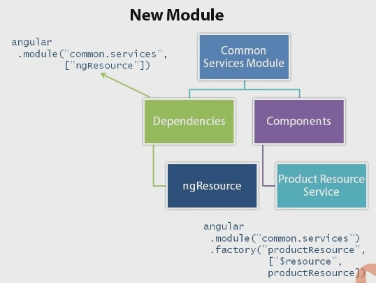
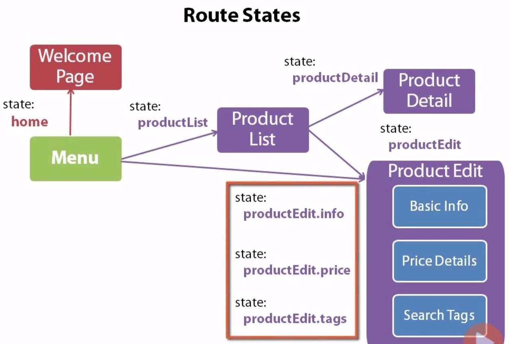

# Angular JS

## Anatomy of an angular application
An application is comprised of modules.

Usually the entire application has a single `index.html` file. The `.css` go in the header while the javascript links go at the bottom of the `body`.

The `ng-app` directive is specified on one of the tags in the `index.html` file and specifies the name of the main module. On load, the browser looks for the `ng-app` directive. To connect the `ng-app` directive with a particular module we use the following syntax
  
  ```
  <body ng-app="ModuleName">
  ...
  ```

**NOTE**: Don't forget to add the corresponding `.js` file that defines the module above to the `index.html` page. 
  
The html code required for other parts of the application is included in view files which are normal html files. To include another file in the main `index.html` file one can use the `ng-include` directive.

Template files have an associated controller that provides the data and logic for the view.

The controller manages the data model for the view and contains the methods required by the view such as processing button clicks.


## Project file organisation
* `css`: Contains all the styling files
* `fonts`: Contains all the font files
* `img`: Contains all the font files
* `lib`: Contains all external JS library files
* `app`: The main application
  * `services`
  * `controllers`
  * `components`   
* `html`: Partial html pages
* `index.html`: Entry point to the application


## Modules
Most applications have one module but can reference other modules.
A module tracks all of the application's code.
The module tracks all of the external dependencies of the application.

### Creating a module
To create a module we use the `module` method which as 2 overloads.

* **Setter method**  
    `angular.module("ModuleName", []);` The first parameter is the module's name, while the second one is an array of dependencies. Angular injects the dependencies. This is called the setter method because it's how you create a module.
* **Getter method**
    `angular.module("ModuleName");` In this case the first and only parameter is the module's name and it's how you can get a reference to an existing module.

This is usually done in the `app.js` file of the application and is bound to a variable named `app`. As this can pollute the top-level name space we often use a self-executing anonymous function know as an Immediately-Invoked Function Expression (IIFE).

```
(function () {
  "use strict";
  var app = angular.module("ModuleName", []);
}());
```

## Controllers
The purpose of the controller is to provide support to a view. The code in the controller defines the model and implements the actions that can be performed from the view.
* Defines model
* Defines actions/methods that can be performed on the view.

### Creating a controller
A controller is registered with one of the applications modules.

1) **Define a surrounding IIFE.** Start by defining the IIFE to wrap around the entire contents of the controller.
    ```
    (function() {
        // Code goes here
    }());
    ```

2) **Look up the module**. To associate the controller with a module we need to have a reference to the module. This is done using the getter syntax `angular.module("ModuleName")`
3) **Register the controller with the module**. This is done using the controller method. The first argument to the controller method is the name of the controller. The second argument is a list of variables names that are bound to the function parameters. The function is the last element of the list as in the example below. The reason why we need to explicitly write out the parameter names is that during the process of minification the name of the variables might change.
        
    ```
    .controller("ControllerNameCtrl", 
      ["$scope1", "$scope2",
       function($scope1, $scope2) {
          // code goes here
       }]);
    ```
    Instead of inlining the function as the last argument in the definition of the controller, we can also write it out separetely and use the function name there instead.

    ```
    .controller("ControllerNameCtrl", 
      ["$scope1", "$scope2", FunctionName]);
       
    function FunctionName($scope1, $scope2) {
        // code goes here
    }
    ```
4) **Write the actual code of the controller**

### Communicating between View and controller
Communication and information passing between the view and the controller can be performed with the following 2 ways:
* **Using `$scope`**  
  The variable `$scope` is a built in angular variable that enables communication between the view and the controller.
  
* **Using controller as**
  With the second method the `$scope` is not required as a parameter and the model and methods are defined on the controller itself. In the view, the model and methods are references using an alias defined in the `ng-controller`. Customarily the name of the variable is `vm` which stands for View Model. The directives inside the view can now access the model and methods of the controller through the alias.
  
  ```
  <body ng-app="MainModule" ng-controller="ProductCtrl as vm>
  ...
  ```


### Best practices for controllers
There are a few best practices when creating controllers
1) Define each controller as a separate .js file. This means that each controller needs a separate script tag in the main.html. 
2) Name the controller in Pascal case
3) Suffix the controller with "Controller" or "Ctrl"
4) Wrap the controller in an IIFE

### Hooking it up to the view
Connecting the controller to the view is done using the `ng-controller` directive applied to the tag that represents the view. The name used is the "logical" name of the controller rather than the filename.

```
<div ng-controller="ProductCtrl">
... 
</div>
```

## Directives
#### `ng-repeat` directive
Usually used for dynamically constructing rows of elements in a table.

```
<tr ng-repeat="p in ps">
  <td>{{p.Item}}</td>
  <td>
    
  </td>
```
Specifically for the img-src attribute, we want to use `ng-src` here, otherwise the browser will attempt to load the image without having evaluated the expression in the curly braces before that.

#### `ng-init` directive
Its use is discouraged, however it allows you to quickly see how things work if a collection was actually populated when prototyping and before you actually connect to a real service.

```
<table ng-init='
  products= [
    { "productId" : 1,
      "imageUrl" : "http://1",
      "Description" : "The dscr1"},
    { "productId" : 2,
      "imageUrl" : "http://2",
      "Description" : "The dscr2"},
  ]'>
  
```

### `ng-click` directive
The `ng-click` directive can be added to a button and it allows to call a method defined in a controller from the view.
```
<div ng-controller="TheController as vm">
  <button 
    type="button"
    ng-click="vm.MethodCall()">Call to Action
  </button>
  ...
```

### `ng-show` and `ng-hide` directives
The `ng-show` and `ng-hide` directives allow us to display or hide elements, when the variable they are pointing to is `true`. Both directives do not affect the loading of the element. For example, if applied to an image, the image will still be downloaded but it won't be displayed.

**CAUTION**. Both directives above expect an expression on the right hand side, and therefore don't require curly braces.

```

```

### `ng-if` directive
Unlike `ng-show` and `ng-hide` that add elements to the DOM but hide them, the `ng-if` directive controls whether a particular element is added to the DOM at all.

## Built-in Angular Services for calling a WebAPI
* `$http`: Facilitates communication with remote web servers. It offers methods like `.get`, `.post`, `.put`. Every call made through `$http` is **asynchronous**. The call returns a promise and `.then` is used to register a callback function that is passed the response from the HTTP call.
    ```
    $http.get("/api/products")
      .then(function(response) {
        vm.products = response.data;
      });
    ```
* `$resource`: While the previous syntax provides access to the raw API, by using the `$resource` one can talk to REST service in a simpler way. It abstracts away the complexity of interacting directly with the HTTP server. The part of the url prefixed with the colon (:) represents the optional parameter.

    ```
    function productResource($resource) {
      return $resource("/api/products/:productId"); 
    }
    ```
  This module is not included by default so we need to register it as a dependency in our modules and also include the .js file in index.html.

  

  Similar to the controller syntax, the `factory` method takes the name of the factory as it's first argument and a list as its second argument. The list contains the names of the parameters as strings, and then the last element of the list is the service function, either as an inline anonymous function, or a function name.
    
* `$httpBackend` This component is used to intercept calls made by `$http` and `$resource` in order to fake their responses if they are not already available. It mocks the calls to the web service and returns static data to the application. There are two implementations of this component:
    1) **ngMock**: This is used for unit testing applications
    2) **ngMockE2E**: This is used for end-to-end testing or backend-less development.
    
  There are a few steps in order for one to mock the web server:
    1) Download the ngMockE2E module and include it in the index.html file. (angular.mocks)
    2) Create a new module that depends on ngMockE2E
    
    ```
    var app = angular.module("serviceMock", ["ngMockE2E"]);
    app.run(function ($httpBackend) {
      var productData = {...};
      var productUrl = "/api/products";
      $httpBackend.whenGET(productUrl).respond(products);    
    });
    ```
    
    3) In the newly created module set up static data
    4) Define the fake responses to the web server calls
    5) Add the new module as a dependency in the Main Module. To end the mocking just remove the dependency from the main module.    

## Routing
Routing is a technique for navigating between the views. Each route represents a specific view and activating a route navigates to that view.

A fragment identifier is the part of the URL after a hash and is used to identify a view. This part of the URL is processed by the client rather than the server. The fragment identifier identifies a state rather than a resource.

Angular provides two frameworks for routing:
1) **ngRoute**: This is an additional module that can be obtained from the angular website and is stored in the file angular-route.js. Navigation is based on URL fragment identifiers. Each route has a URL fragment identifier, a view template and an optional controller.
2) **UI router**: Third party library available on github. It is based on application states. Each state has a fragment identifier, view template, controller and additional behavior.

We are going to use UI router.

### Steps to defining a SPA
1) The first step is to define  the application's site map and associate a state for each page in the sitemap. The name of the state needs to be unique across the application.
2) Create the layout of the main page of the application. In the context of SPA's (Single Page Applications) in this step we create the page. This page defines common elements across all pages, like a header, a menu bar or a footer and defines the area where all other views are going to appear. Each individual view is defined in it's own html template and is inserted in the layout template in response to user actions.

### Setting up the routing
* **UI router**
    1) Download the UI router module
    2) Set the script tag for UI router in the index.html file
    3) Setup UI router as a dependency to the main application.
* **Layout view**
    1) Identify where the views appear
        ```
        <body>
          <div class="container>
            <div ui-view></div>
          </div>
        </body>
        ```
    2) Add the `ui-view` directive
    3) Or use `data-ui-view` if the browser doesn't support the former.
* **Routes**
  1) Identify the route states
    The UI router provides a `$stateprovider` that allows us to define the various states of the application. Each state is defined using the `state` method. The state method takes 2 arguments, the name of the state and an object. The objects properties are used to define the parameters for the state.
     * The `url` property defines the URL fragment identifier (whatever comes after the #). It is useful for enabling deep linking into the application states and for ensuring that the browser's back and forward buttons work as expected. The `url` can contain parameters which are specified with a colon. For example, `/products/:productId` will substitute the `:productId` part with a real id when navigating to that view. 
     * The `templateurl` property defines the path to the view file. 
     * The third property is optional and defines the controller associated with the view. There are more properties that can be used, so check the documentation for more properties.
      ```
      $stateprovider
        .state("StateName", {
          url : "/products",
          templateurl : "app/products/productsView.html",
          controller : "ProductController as vm"
        });
      ```
      States can be chained together in a fluent style.
      
  2) Define the routes in the code
    The state configuration can be placed in the main application file using the `config` method of the angular module as in the example below. This method takes an array as an argument which has the string names of the parameters followed by an actual function as the last element of the array. 
      ```
      angular.module("theApp", [...])
        .config(["$stateProvider", function($stateProvider) {
          // code from above goes here.
        }]);
      ```
      
  3) Define a default State for the application
    If you access the URL fragment directly you'll be able to see the view. However it is useful to define a default view for the application. This is done using the `$urlRouterProvider` service. This service watches the `$location` variable for changes to the URL. Whenever the URL changes it tries to find a matching state and then activates that state. It also provides an `otherwise()` method for defining the default URL.
      ```
      app.config(["$stateProvider", "$urlRouterProvider", 
        function($stateProvider, $urlRouterProvider) {
          $urlRouterProvider.otherwise("/products");
        }]);
      ```


### Activating a route
There are 3 ways to activate a route
1) **Set the URL**
2) **Use code**
    Using the `$state.go("productList");` method call. The argument is the state name and **not** the URL fragment
3) **Click a link**
    Links need to use the `ui-sref` directive to navigate to a state. **Note** that his technique also uses the state name and **not** the URL fragment.
    ```
    <a ui-sref="productList">
    </a>
    ```

### Using resolve to pre-load data 
The object used in the definition of the state can take an extra argument to pre-load the data for a particular state.

`Resolve` is a property of the state configuration object that can be attached to a route. It can provide custom data to the defined controller. It identifies a set of dependencies that can be used and injected in the controller. If the dependency is a promise, the promise is resolved before the controller gets instantiated and the route gets changed. So if the code is retrieving data, the code waits until the data is fetched before switching and displaying the view. These dependencies are defined using key-value pairs, where key is the name of the dependency and the value is a string of the service that can be injected, or a function.

```
$stateprovider
  .state("StateName", {
    url : "/products",
    templateurl : "app/products/productsView.html",
    controller : "ProductController as vm",
    
    resolve : {
      anyServiceName : "The string name of the service dependency",
      
      product : function(anyServiceName, $stateParams) {
        var productId = $stateParams.productId;
        return anyServiceName.get(
          { productId : productId }).$promise;
      }
    }
  });

```

In the example above the `anyServiceName` key can have any name. The actual value is the name of the service as defined previously.The resolve assumes that any string name provided as a value is an alias for the service.

The second property of the resolve object defines a dependency on the result of a function. The function is used to fetch the data from the service. To pass parameters to the service call, we use the `$stateParams` service defined by UI router. This service is populated with the available parameters for this state. To ensure that the function execution is delayed we use the `$promise`.


### Nested views (wizards)
Nested views are named using a dot notation (`MainState.NestedView`) and are defined in the state definition like a normal state.



In code this could be done as follows.
```
.state("productEdit", {
  url : "/product/edit/:productId",
  templateurl : "app/products/productEditView.html",
  controller : "ProductEditCtrl as vm"
})
.state("productEdit.info", {
  url : "/info",
  templateurl : "app/product/productEditInforView.html",
})
.state("productEdit.price", {
  url : "/price",
  templateurl : "app/product/productEditPriceView.html",
})
...
```
**Note** 
1) The nested views do not require a controller definition. The nested views can share the controller from the parent state. 
2) Take note of the urls of the nested states.
3) To resolve data for nested states, we can get the required data in the parent state, and pass that information do the nested states.

#### Abstract state
When a parent state is meaningless to display without one of its nested states, then we can declare it as an Abstract state. An abstract state cannot be explicitly activated and any attempt to activate it throws an exception. It is activated implicitly when one of its child states gets activated.

To declare a state as abstract add it as an extra property in the state configuration as below.

```
.state("productEdit", {
  abstract : true,
  url : "/product/edit/:productId",
  templateurl : "app/products/productEditView.html",
  controller : "ProductEditCtrl as vm"
})
```

## Directives
### Using a directive
Directives can be used in 4 different ways. Of those only the first two are recommended.
  1) **As attributes on existing html tags** 
      ```
      <div my-directive>
      ```
  2) **As new html tags** 
      ```
      <my-directive></my-directive>
      ```
  3) **NOT RECOMMENDED** As classes  
      ```
      <div class="my-directive">
      ```
  4) **NOT RECOMMENDED** As comments  
      ```
      <!-- my-directive -->
      <div>
      ```    

### Creating a directive
To create a directive get the module and add a directive
```
angular.module("portfolioDashboardApp.services")
    .directive("exposuresChart", exposuresChart);
    

function exposuresChart() {
    return { ... };
};
```
**NOTE**: When creating the directive we use camel case. However when using the directive as an attribute we need to add dashes (-) or underscores (_) between the various words.
```
<div exposures-chart>...</div>
```

The returned object from the directive has certain properties
* **restrict**: This defines how the directive is to be used, as an **A**ttribute, **E**lement, **C**omment or **C**lass
* **template**: The string passed in the template is what gets embedded inside the directive element. However this can get a bit complex so we can use external templates.
* **templateUrl**: When the template string gets too unwieldy put the html in an external file and use this attribute to point to the file instead.
* **replace**: This instructs angular to replace the directive inside the dom? When replace is set to `true` the template html needs to be wrapped in a root level node.
* **controller**: We can place functions inside the directive so that it responds to user interaction

### Types of directives
* **Component/Widget**: Data and associated display
* **Decorator**: ng-click, ng-show, ng-hide
* **Structural/templating**: ng-repeat