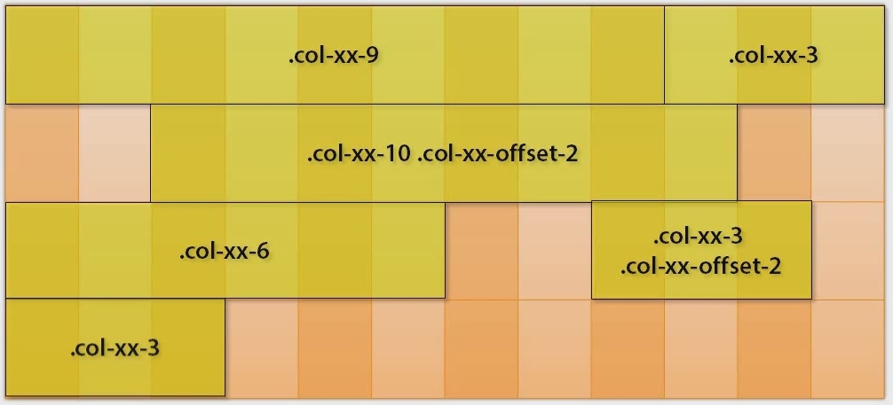

# Bootstrap

## Adding bootstrap 
To add bootstrap you need to include two files to the existing page:
1) The bootstrap CSS file. The CSS file goes in the head of the html page and it should come before the `site.css` so that we can override any definitions in our own stylesheet.

    `<link rel="stylesheet" href="css/bootstrap.min.css" />`
    
    **Optional**: If we wish to apply a global theme to the default bootstrap one we can add it right after the the declaration above. This is usually done with:
    
    `<link rel="stylesheet" href="css/bootstrap-theme.min.css" />`

    There is a website that offers free themes for bootstrap called
    [Bootswatch.com](http://bootswatch.com/) 
    
2) The bootstrap Javascript file. This file goes at the bottom of the html page right before the clossing `body` tag.
      
    `<script src="js/bootstrap.min.js" />`
    


It is a good practice to have the entire page included in a `div` container. If we add the bootstrap class `.container` which is the top level page element. The container responds to different screen sizes. 

## The Grid System
Bootstrap is built on a grid that consists of 12 vertical units. Inside the container there are 12 logical units. Each bootstrap can take up a different number of logical units.

### Class naming
Each class has three parts
* col
* screen size: 
  * lg >= 1200px (desktop computer)
  * md >= 992px (laptops)
  * sm >= 768px (tablets)
  * xs < 768pm (phones)
* number of columns the element takes up 


At times you can also skip elements by using the `offset` part. Elements that do not fit on the row are pushed onto the next row.



## Multiple grids
Depending on the screen size we can change the number vertical units each elements takes. So for example we could be using 12 units on a laptop screen, but only 8 on a desktop computer. This allows each page to respond to the size of the screen.

## Offsets and rows
To define a logical row we can use the `row` class on a `div`. What this will do is that any sizing information inside the div is going to be treated as an atomic unit and any subsequent positioning of elements will get a fresh start.

## Images and responsive helpers
On an `img` tag we can specify various classes to force the text to flow around it.
* `pull-left`: It pulls the image to the left and the text reflows to the right of the image.
* `pull-right`: Pulls the image to the right and the text re-flows to the left of the image.
* `img-thumbnail`: It adds a little border and offset around the image and resizes it appropriately when used on a phone or tablet screen.
* `hidden-xs`: When added to an element the element is hidden when the screen size is small.
* `visible-lg`: It is only visible when in a lg screen. It is the opposite of the one above.

# Theming
You can override the basic elements provided by bootstrap in a site.css file
* `navbar`: Specifies that a particular `div` is to be used as a navigation bar.
* `navbar-default`
* `btn`: Can be applied to a `button` tag so that it's styled using bootstrap.
* `lead`: Can be used on a `p` tag to indicate that this particular paragraph is more important and is displayed in larger font.
* `text-muted`
* `text-primary`
* `text-success`
* `text-warning`

## Buttons
The default bootstrap look for a button is done through the `btn` class. All the classes below can also be used on `href` tags.
* **Button function**
  * `btn-primary`, `btn-warning`, `btn-muted`, `btn-success`
* **Sizing**
  * `btn-lg`,`btn-md`, `btn-sm`, `btn-xs`

## Glyphicons
A number of icons can be used out of the box. To use one, insert a `span`, and select which icon you want:

    <span class="glyphicon glyphicon-earphone"></span>

## Navs and navbars
To define something as a navigation bar we add the `navbar` class. To style it we use the `navbar-default`. Within the navbar we can have a header declared with `navbar-header` and the actual navigational links. The links are grouped using the tag `nav navbar-nav` and each link is marked using `nav`. To flush the group of links to the right we use `navbar-right`. The `active` class styles the currently active navigational element to denote which page we are on.


  ```
  <div id="menu" class="navbar navbar-default navbar-fixed-top">
    <div class="navbar-header">
      <button class="btn btn-success navbar-toggle" 
        data-toggle="collapse"
        data-target=".navbar-collapse" ...>
      <div id="logo">...
    </div>
    <div class=navbar-collapse collapse">
      <ul class="nav navbar-nav navbar-right">
        <li class="nav active"><a href=""></a></li>
        <li class="nav"><a href=""></a></li>
        <li class="nav"><a href=""></a></li>
      </ul>
    </div>
  </div>
  ```

To be able to collapse a navigation bar when the screen size is too small we use the class `navbar-collapse collapse`. to associate a button with a collapsible set of links, we put the class `navbar-toggle` on.

## Lists
* `list-unstyled`: Takes away the bullets and indentation that are included by default
* `list-inline`: Takes the same list but places the items linearly on a single line. From left to right
* `list-group` and `list-group-item`. Looks like an iOS list of settings
* `badge`: Applied to a span within a `list-group-item` it allows you to show information about the item, e.g. number of messages in the email folder.

## Tables
To style a table using bootstrap add the class `table`.
* `table-striped`: Colors the table using alternating colors.
* `table-bordered`: Adds a border
* `table-hover`: Make the rows highlight as the mouse moves over them.
* `table-condensed`: Makes the table 'tighter' by removing padding from each row.
* `table-responsive`: Apply this to a div that contains the table

## Some useful HTML5 tags 
The following are some useful HTML5 tags.
* `<section>`: Defines a section in a document, such as chapter, header, footer, etc. 
* `<header>`: It represents a container for introductory content or a set of navigational links. It typically contains one ore more heading elements. 
* `<nav>`: It defines a set of navigational links.